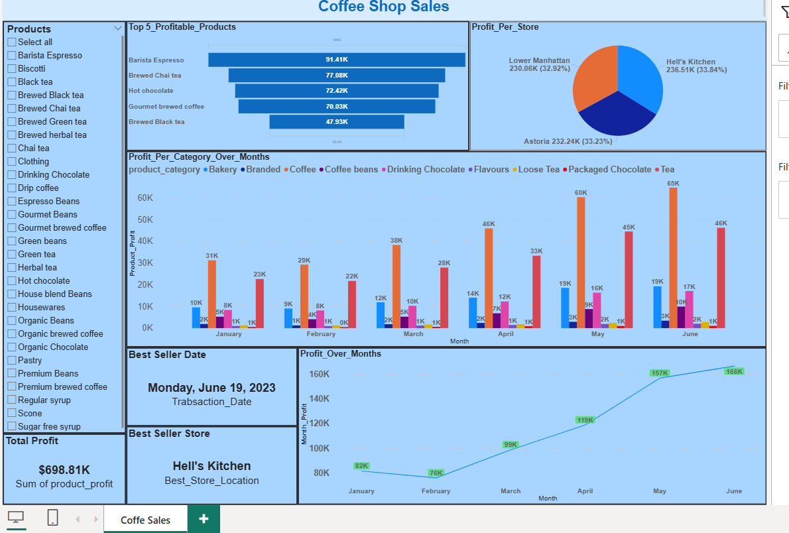

# ☕ Coffee Shop Sales -- Power BI Dashboard

## 📌 Project Overview

This project presents an interactive **Power BI dashboard** analyzing
sales and profitability data from a coffee shop chain. The report
provides insights into product performance, store profitability,
seasonal trends, and key business drivers to support data-driven
decision-making.

## 📊 Dashboard Features

-   **Top 5 Profitable Products** -- Barista Espresso leads with over
    **91K** in profit.
-   **Profit by Store** -- Hell's Kitchen is the most profitable store,
    contributing **33.8%** of total profits.
-   **Profit by Category Over Months** -- Coffee consistently drives the
    highest revenue, peaking at **65K in June**.
-   **Best Seller Date** -- June 19, 2023, marked the highest sales
    day.
-   **Best Performing Store** -- Hell's Kitchen.
-   **Total Profit** -- \$698.81K across all stores.
-   **Profit Trends** -- Profits steadily increased from **82K in
    January** to **166K in June**.

## 🛠️ Tools Used

-   **Microsoft Power BI** -- Data visualization & dashboarding.
-   **Data Sources** -- (Specify: Excel/CSV/Database, e.g., *Coffee Shop
    Sales Dataset*).

## 🚀 How to Use

1.  Download the `.pbix` file from this repository.
2.  Open it in **Power BI Desktop**.
3.  Explore interactive dashboards using filters and slicers.

## 📂 File Structure

-   `Coffee_Shop_Sales_Report.pbix` → Main Power BI report.
-   `README.md` → Project documentation.
-   `Dashboard_Screenshot`.
-   `Coffee Shope Sales Dataset`.

## 📸 Dashboard Preview 
`

-   Add customer demographic analysis.\
-   Include forecast modeling for sales trends.\
-   Integrate external datasets (e.g., weather, holidays) for deeper
    insights.
